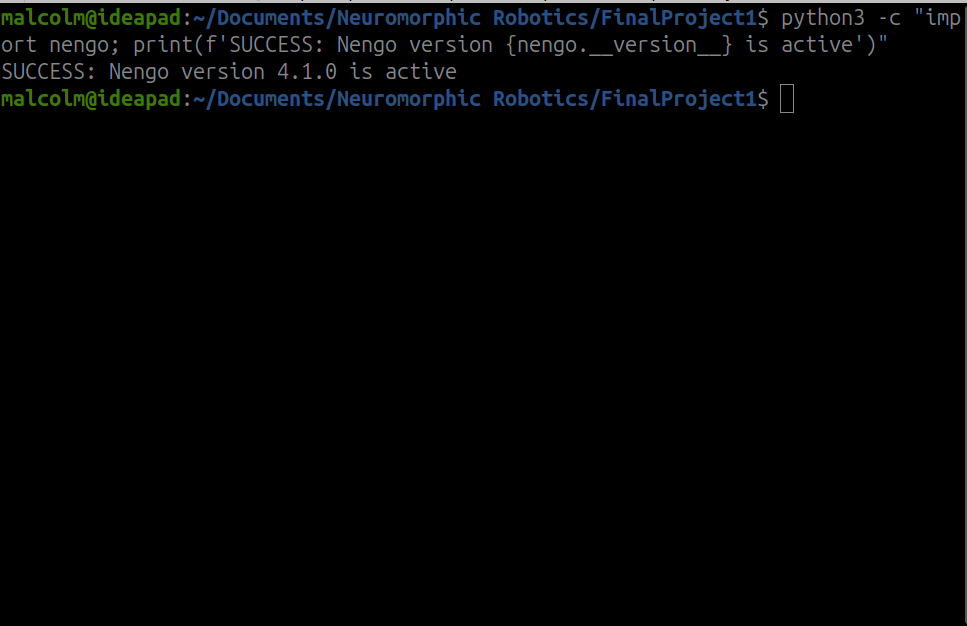
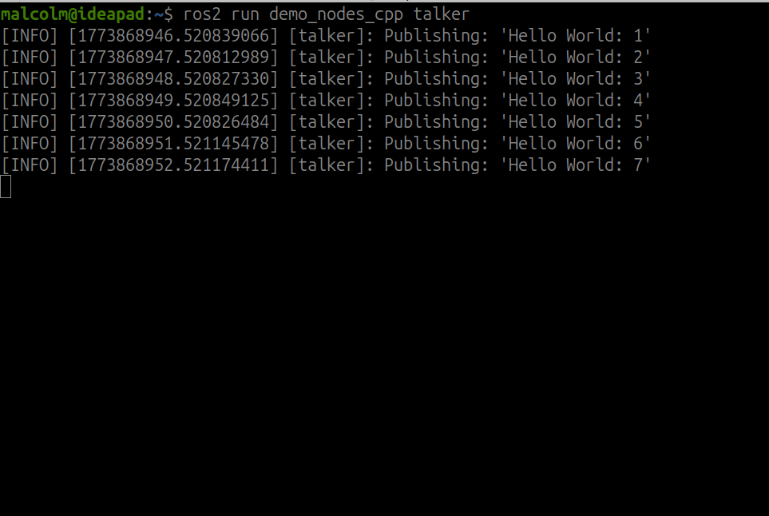
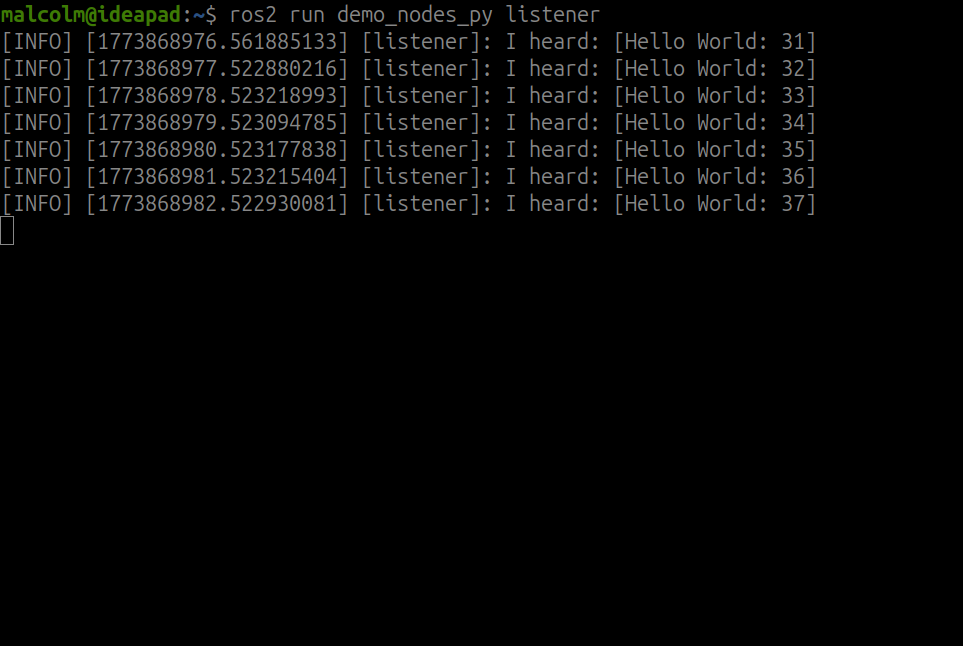

# Lab 1 Report
#### **Malcolm Benedict**

TODO: get screenshot 2 (ROS version number) my ROS is jazzy, which is technically wrong
TODO: write report body

Figure 1: Nengo Library Installed

Figure 3: Talker Node Output

Figure 4: Listener Node Output
